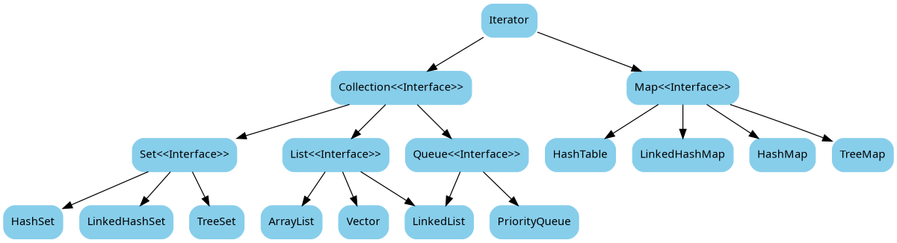

Java容器类是java提供的工具包，包含了常用的数据结构：集合、链表、队列、栈、数组、映射等。Java容器类库定义了两个不同概念的容器，Collection和Map。

<!-- more -->

#### Collection接口

Collection的定义如下：

```Java
public interface Collection<E> extends Iterable<E> {}
```

它是一个接口，是高度抽象出来的集合，它包含了集合的基本操作：添加、删除、清空、遍历(读取)、是否为空、获取大小、是否保护某元素等等。在Java中所有实现了Collection接口的类都必须提供两套标准的构造函数，一个是无参，用于创建一个空的Collection，一个是带有Collection参数的有参构造函数，用于创建一个新的Collection，这个新的Collection与传入进来的Collection具备相同的元素。



Graphiz绘制图形源码：


