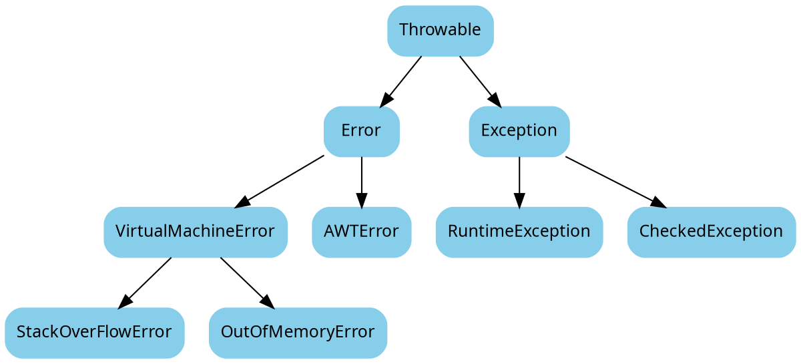

#### Java异常关系

* Throwable是所有异常的根，java.lang.Throwable
* Error是错误，java.lang.Error
* Exception是异常，java.lang.Exception

<!-- more -->

Java异常的分类如下图所示：



图形绘制(graphviz)源码：



编译命令：

```Bash
dot -Tjpg -Gdpi=1024 java-exception.dot -o java-exception.jpg
```

RuntimeException是那些可能在 Java 虚拟机正常运行期间抛出的异常的超类。可能在执行方法期间抛出但未被捕获的RuntimeException的任何子类都无需在throws子句中进行声明。除了runtimeException以外的异常，都属于checkedException，它们都在java.lang库内部定义。Java编译器要求程序必须捕获或声明抛出这种异常。一个方法必须通过throws语句在方法的声明部分说明它可能抛出但并未捕获的所有checkedException。
* Java.lang.ClassNotFoundException
* Java.lang.CloneNotSupportedException
* Java.lang.IllegalAccessException
* Java.lang.InterruptedException
* Java.lang.NoSuchFieldException
* Java.lang.NoSuchMetodException
